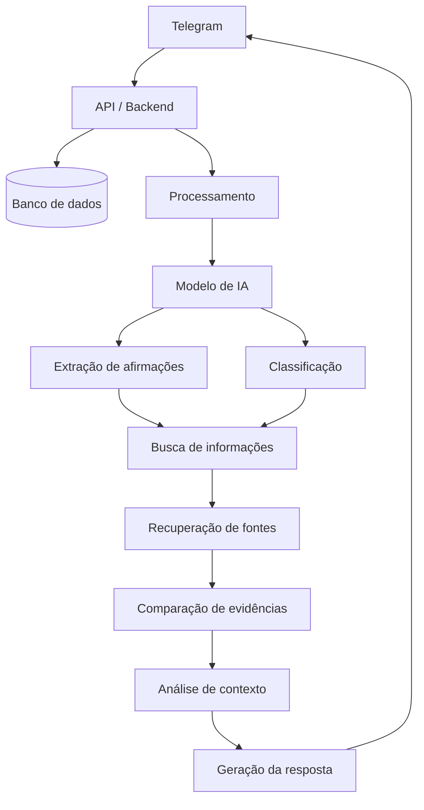
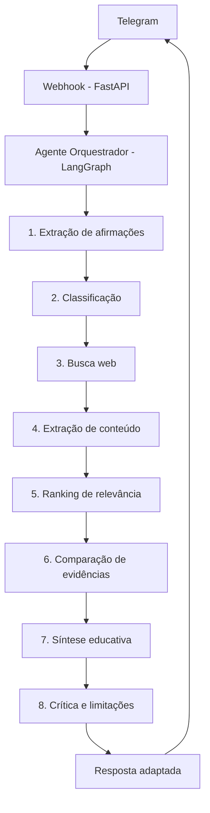

# Arquitetura

## Escopo do MVP

O MVP deve ser suficientemente pequeno para permitir uma implementação e avaliação realistas.

### Entradas aceitas

- texto;
- links.

Exemplos:

> "O governo vai proibir determinado produto amanhã."
>
> `https://exemplo.com/noticia`

O sistema deve ser capaz de analisar tanto uma afirmação digitada diretamente quanto uma informação extraída de uma página.

### Fora do escopo inicial

- análise avançada de vídeos;
- análise de áudios;
- transcrição de áudios;
- análise multimodal completa;
- monitoramento permanente das conversas;
- criação de perfis políticos dos usuários;
- classificação automática definitiva de pessoas ou fontes;
- treinamento de um modelo de linguagem próprio;
- sistema completo de detecção de campanhas coordenadas.

Esses recursos podem ser considerados em versões futuras.

!!! note "Extensibilidade"
    Embora o texto seja a base do MVP, o combate real à desinformação também exige apontar manipulações de contexto em imagens e cortes tendenciosos em vídeos. O sistema pode começar analisando apenas textos e links, mas a arquitetura deve prever a integração futura de visão computacional, em vez de fechar portas para essa extensão.

## Arquitetura conceitual

A arquitetura tecnológica específica é detalhada na seção de stack tecnológico abaixo.

## Arquitetura do MVP

## Stack tecnológico previsto

| Área | Tecnologia |
|---|---|
| Orquestração | LangGraph |
| LLM | Qwen 2.5 72B via OpenRouter |
| Busca | Tavily API |
| Embeddings | Colibri ou multilingual-e5-small |
| Banco vetorial | PostgreSQL + pgvector |
| Backend | FastAPI |
| Telegram | Telegram Bot API |
| Ambiente de testes | Ngrok |
| Extração de conteúdo | trafilatura ou BeautifulSoup |

!!! note "Nota de atualização"
    O documento original avaliou tanto hospedagem local via Ollama (modelos abertos e leves, como Llama 3.1 ou Qwen 2.5 comprimido, para zerar custo de API) quanto um modelo maior via API. A decisão de tamanho de modelo deve ser validada com métricas reais por subtarefa (extração, classificação, comparação de evidências, síntese) antes de comitar a um único modelo para todo o pipeline, em vez de assumir um modelo grande por padrão.

### Fora do MVP

Para manter o prazo viável, o MVP não inclui inicialmente:

- múltiplos provedores de busca;
- processamento assíncrono com Celery e Redis;
- integração com Guardian API, NewsAPI ou serviços semelhantes;
- interface web própria;
- sistema de autenticação de usuários;
- cache distribuído;
- áudio;
- imagens;
- gamificação.

Esses itens podem ser avaliados posteriormente, caso exista tempo e necessidade.
