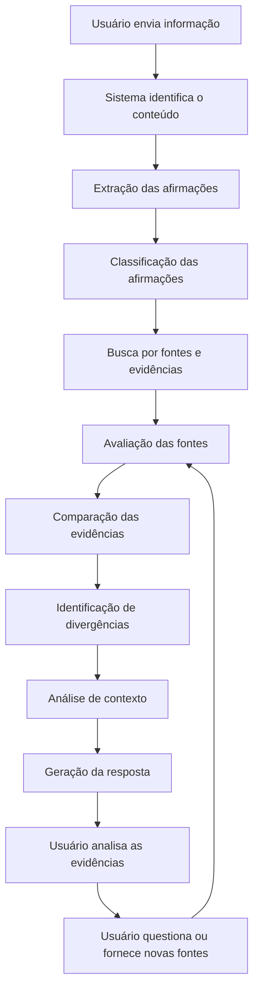
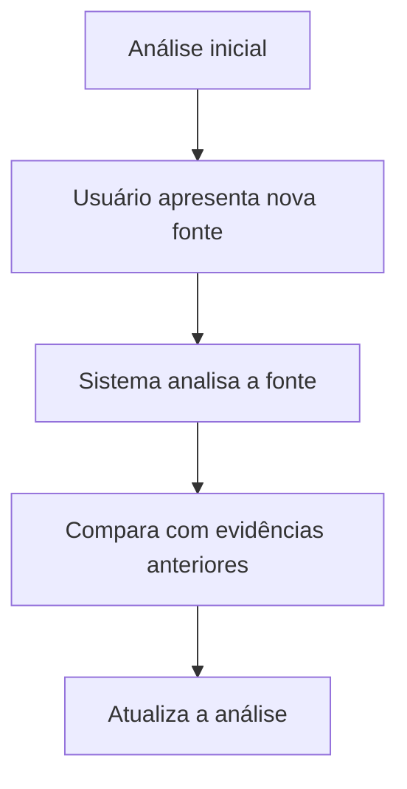

# Fluxo e interação

## Fluxo principal do sistema



## Identificação de afirmações

Uma mensagem pode conter várias afirmações diferentes. Por exemplo:

> "URGENTE! O governo anunciou ontem que a gasolina vai subir 20% amanhã."

O sistema pode identificar quatro afirmações distintas dentro dessa única mensagem:

- o governo anunciou uma alteração;
- a alteração está relacionada ao preço da gasolina;
- o aumento será de 20%;
- o aumento ocorrerá amanhã.

Cada afirmação pode exigir fontes diferentes. Por isso, o sistema não deve tratar a mensagem inteira como uma única unidade de verificação.

!!! note "Requisito"
    O sistema deve identificar e decompor mensagens complexas em afirmações potencialmente verificáveis.

## Classificação das informações

Antes da verificação, o sistema deve tentar determinar a natureza da informação. Categorias possíveis:

- fato verificável
- opinião
- previsão
- hipótese
- sátira
- informação histórica
- informação atual
- alegação científica
- alegação médica
- alegação política
- alegação econômica
- informação fora de contexto

Essa classificação evita que o sistema tente provar ou refutar algo que não tem uma resposta factual objetiva.

## Interação conversacional

O sistema não é uma ferramenta de consulta única. Depois de receber uma análise, o usuário pode:

- solicitar explicação;
- abrir uma fonte;
- perguntar sobre uma evidência;
- fornecer uma nova fonte;
- contestar a análise;
- solicitar o contexto original;
- analisar uma afirmação específica.

Exemplo de troca:

```
Bot: Encontramos evidências conflitantes.

Usuário: Mas essa fonte aqui diz que é verdade.
[usuário envia novo link]

Bot: Analisei a nova fonte. Ela apresenta uma evidência
relevante, mas utiliza os mesmos dados da Fonte A.
Por isso, ela não representa uma evidência independente.
```

## Usuário fornecendo novas evidências



O sistema pode inclusive informar quando a nova evidência muda significativamente a análise anterior. Isso reforça o princípio de que conclusões são baseadas em evidências e podem mudar diante de novas informações.

## Perguntas reflexivas

O sistema pode usar perguntas para estimular o pensamento crítico, por exemplo:

- "Qual é a principal afirmação desta mensagem?"
- "Qual fonte está sendo utilizada como evidência?"
- "A fonte original está disponível?"
- "Essa informação aparece em fontes independentes?"
- "O que poderia fazer você mudar de opinião?"
- "Depois de analisar as evidências, quão confiável você considera essa informação?"

Essas perguntas não devem transformar a experiência em um questionário longo. A quantidade de interação deve se adaptar ao contexto.

## Interface conversacional no Telegram

Como o sistema é usado pelo Telegram, a experiência deve ser pensada para mensagens curtas e progressivas, evitando respostas excessivamente longas logo na primeira mensagem. Um fluxo possível:

```
🔎 Encontrei 2 afirmações verificáveis.
Vou analisar primeiro a principal.

[Analisando...]

📌 Afirmação:
"A gasolina vai subir 20% amanhã."

📚 Encontrei:
• 2 fontes favoráveis
• 3 fontes que contradizem a afirmação
• 1 fonte oficial relacionada

Quer ver a análise completa?
[Ver análise]  [Ver fontes]  [Questionar]
```

Isso permite que o usuário escolha o nível de profundidade da resposta.

## Estrutura detalhada da resposta

Uma análise completa pode conter, nesta ordem:

1. Afirmação analisada
2. Resumo do contexto
3. Evidências favoráveis
4. Evidências contrárias
5. Fontes primárias
6. Outras fontes relevantes
7. Relação entre as fontes
8. Divergências
9. Pontos de atenção
10. Limitações
11. Avaliação do usuário

## Avaliação feita pelo usuário

Ao final da análise, o sistema pode perguntar:

> "Depois de analisar essas evidências, como você avalia essa informação?"

Com respostas possíveis como: *parece confiável*, *tenho dúvidas*, *parece pouco confiável*, *não consigo decidir*.

O objetivo não é medir se o usuário "acertou". É entender como as evidências apresentadas influenciaram sua avaliação.
