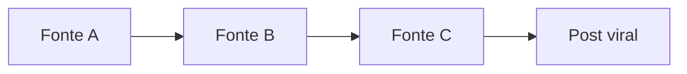
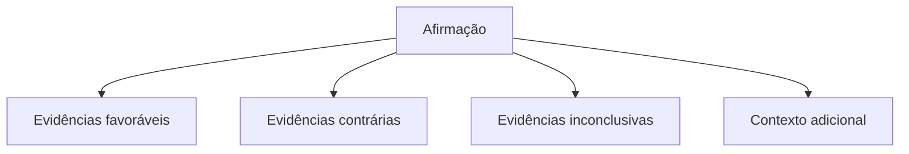

# Fontes e evidências

## Busca de evidências

Após identificar uma afirmação, o sistema procura informações relevantes para sua avaliação. A busca deve procurar evidências que:

- sustentem a afirmação;
- contradigam a afirmação;
- contextualizem a afirmação;
- apresentem informações adicionais;
- indiquem a origem da afirmação.

Uma regra fundamental é evitar buscar apenas informações que confirmem a hipótese inicial. O processo deve considerar deliberadamente perspectivas contrárias.

## Hierarquia de fontes

O sistema considera a natureza e a relação da fonte com a afirmação. Essa hierarquia **não** é uma regra absoluta de verdade: uma fonte primária também pode conter erros, assim como uma fonte secundária pode apresentar uma interpretação correta. O objetivo é avaliar a qualidade e a relevância da evidência para aquela afirmação específica.

| Nível | Categoria | Exemplos |
|---|---|---|
| 1 | Fontes primárias | Documentos oficiais, legislação, artigos científicos originais, bancos de dados, relatórios, declarações originais, documentos institucionais |
| 2 | Instituições especializadas | Universidades, instituições de pesquisa, organizações profissionais, órgãos especializados |
| 3 | Veículos jornalísticos | Veículos com histórico e processos editoriais identificáveis |
| 4 | Fontes secundárias | Blogs, agregadores e páginas que reproduzem ou interpretam informações de outras fontes |
| 5 | Conteúdo não verificado | Publicações anônimas, posts isolados, conteúdos sem origem identificável |

## Independência das fontes (efeito eco)

Um dos problemas importantes a investigar é o efeito eco: um usuário pode encontrar quatro páginas diferentes e concluir que existem quatro confirmações independentes, quando na verdade todas têm origem na mesma publicação.



Quando possível, o sistema deve identificar relações entre fontes e informar algo como:

> "Embora existam várias páginas reproduzindo essa informação, identificamos uma possível fonte original comum."

Essa funcionalidade pode se tornar um diferencial importante do sistema.

## Comparação das evidências

As evidências devem ser organizadas em categorias:



O sistema não deve apresentar apenas evidências que sustentem uma conclusão previamente escolhida. Quando houver evidências relevantes em sentidos diferentes, elas devem ser apresentadas.

## Divergência entre fontes

Fontes confiáveis podem discordar por diferença metodológica, períodos diferentes, interpretações diferentes, dados incompletos, evolução do conhecimento ou diferentes definições de um conceito.

O sistema deve diferenciar claramente:

- "fontes confiáveis concordam";
- "fontes confiáveis apresentam resultados diferentes";
- "não existem fontes suficientes para concluir".

## Contexto temporal

Algumas informações dependem diretamente do momento em que são verificadas: notícias, alterações legislativas, eleições, preços, alertas, acontecimentos recentes, decisões judiciais, pesquisas em andamento.

O sistema deve considerar a data das fontes e, sempre que relevante, informar algo como:

> "Esta análise considera informações disponíveis até [data]."

Uma informação que era correta anteriormente pode estar desatualizada no momento da consulta.

## Resultado da análise

O sistema não deve usar como resultado principal "VERDADEIRO" ou "FALSO". Em vez disso, apresenta uma síntese das evidências, por exemplo:

```
ANÁLISE

Afirmação:
"O governo vai proibir X em outubro."

Evidências favoráveis:
🟢 Fonte A apresenta...

Evidências contrárias:
🔴 Fonte B indica...

Contexto:
A informação está relacionada a...

Pontos de atenção:
• A publicação original não foi encontrada.
• Duas páginas utilizam a mesma fonte.

Avaliação das evidências:
🟡 Evidências conflitantes

Limitações:
Não foram encontradas fontes primárias suficientes.
```

Indicadores visuais podem ser usados, desde que não sejam interpretados como uma decisão absoluta.

## Níveis de evidência

| Indicador | Nível | Significado |
|---|---|---|
| 🟢 | Evidência forte | Existem fontes relevantes, independentes e consistentes. |
| 🟡 | Evidência conflitante | Existem fontes relevantes apresentando resultados diferentes. |
| 🟠 | Evidência insuficiente | Existem poucas evidências ou fontes relevantes. |
| 🔴 | Evidência contrária forte | As principais fontes disponíveis apresentam evidências incompatíveis com a afirmação. |
| ⚪ | Não verificável | Não existem informações suficientes para uma avaliação adequada. |

Essas categorias descrevem o estado das evidências, não a verdade absoluta da afirmação.

## Limitações da análise

Cada análise deve informar suas limitações, por exemplo: ausência de fonte primária, informação muito recente, fontes conflitantes, fontes inacessíveis, falta de contexto, ausência de dados suficientes, possível erro de interpretação, evidências de baixa qualidade.

!!! warning "Regra inegociável"
    O sistema nunca deve preencher uma lacuna de conhecimento com uma informação inventada.

## Transparência da IA

O usuário deve conseguir compreender, em linguagem simples, como o sistema chegou à sua análise. A explicação pode indicar quais afirmações foram identificadas, quais fontes foram encontradas, quais evidências foram consideradas, quais fontes divergiram e quais limitações foram encontradas.

Não é necessário expor processos internos complexos do modelo: o objetivo é transparência útil, não uma explicação técnica incompreensível.

Um mecanismo concreto para isso é expor o passo a passo da investigação: os termos de busca utilizados e os trechos exatos extraídos de cada portal. Isso não serve só para justificar a resposta, mas ensina o usuário a replicar o processo por conta própria em uma busca comum.

## Incerteza e alucinações

A IA pode produzir informações incorretas, inventar relações ou interpretar fontes de forma inadequada. Por isso, o sistema precisa de mecanismos para reduzir e comunicar esse risco, indicando por exemplo:

> "A análise possui incerteza porque não encontramos uma fonte primária."

ou:

> "A informação encontrada não é suficiente para confirmar essa afirmação."

Nunca deve ser apresentado um nível de certeza artificialmente alto apenas porque o modelo precisa gerar uma resposta.

## Critérios para seleção de fontes

A seleção deve considerar: relevância, proximidade da fonte com o evento original, autoridade institucional, data, existência de evidências, transparência metodológica, independência em relação a outras fontes e consistência com documentos primários.

Um domínio conhecido não é, por si só, suficiente para considerar uma fonte correta.

## Tratamento de fontes conflitantes

Quando duas fontes confiáveis divergem, o sistema deve:

- identificar a divergência;
- apresentar as fontes;
- explicar o motivo conhecido da divergência, quando possível;
- considerar datas e metodologias;
- evitar escolher arbitrariamente uma fonte;
- informar que a evidência é inconclusiva quando apropriado.
