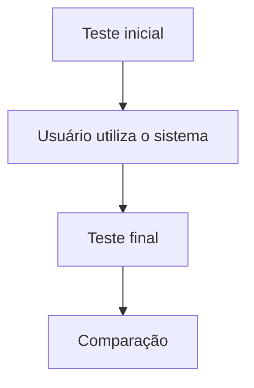

# Métricas e avaliação

## Métricas técnicas

- precisão;
- recall;
- F1-score;
- taxa de identificação correta das afirmações;
- qualidade das fontes recuperadas;
- taxa de alucinação;
- taxa de respostas sem evidência;
- precisão na identificação de divergências.

Essas métricas devem ser avaliadas separadamente, para evitar que um bom resultado em uma etapa esconda problemas em outra.

## Métricas de experiência do usuário

- facilidade de uso;
- tempo necessário para compreender a análise;
- clareza da resposta;
- compreensão das fontes;
- satisfação;
- quantidade de fontes consultadas;
- frequência de perguntas adicionais;
- capacidade de compreender as limitações.

## Métricas de pensamento crítico

Essas métricas são centrais para o projeto:

- capacidade de identificar a fonte original;
- capacidade de reconhecer evidências insuficientes;
- capacidade de diferenciar opinião de fato;
- capacidade de identificar informação fora de contexto;
- capacidade de comparar fontes;
- capacidade de reconhecer dependência entre fontes;
- capacidade de identificar linguagem manipulativa;
- capacidade de avaliar uma nova informação sem assistência.

!!! success "Principal indicador de sucesso"
    O usuário consegue avaliar melhor uma nova informação sem utilizar o bot depois de utilizar o sistema?

## Avaliação do pensamento crítico

A principal avaliação educacional deve ocorrer em uma situação diferente daquela analisada durante o uso do sistema:

O teste final deve usar informações novas, que não foram apresentadas durante o treinamento ou uso do bot. Assim, é possível investigar se o usuário realmente aprendeu estratégias de avaliação.

## Experimento comparativo

Uma possibilidade é dividir participantes em dois grupos:

- **Grupo A**: recebe uma conclusão simplificada, por exemplo "essa informação é provavelmente falsa".
- **Grupo B**: recebe afirmação, evidências, fontes, contrapontos, contexto, limitações e perguntas reflexivas.

Depois, ambos os grupos recebem novas informações e precisam avaliá-las sem assistência. A hipótese é que o grupo B apresente maior capacidade de avaliação independente.

## Critérios de sucesso do MVP

O MVP pode ser considerado bem-sucedido caso:

- consiga identificar corretamente as principais afirmações;
- encontre fontes relevantes;
- apresente fontes favoráveis e contrárias quando existentes;
- comunique adequadamente situações de incerteza;
- reduza respostas sem evidência;
- permita interação e contestação;
- seja compreensível para usuários comuns;
- não incentive a interpretação da IA como autoridade absoluta;
- demonstre melhoria na capacidade dos usuários de avaliar novas informações.
