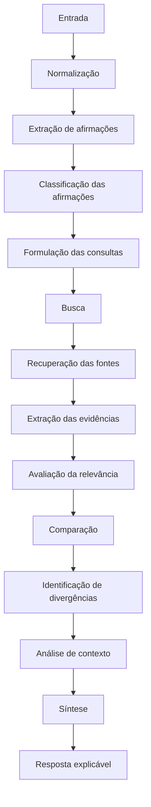
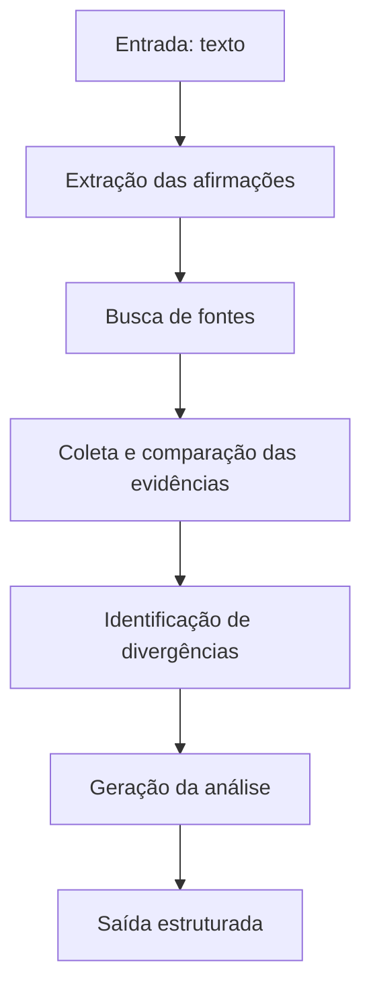

# Pipeline de IA

## Etapas do pipeline

Cada etapa deve ser testável individualmente, o que permite validar modelos e prompts por subtarefa em vez de avaliar apenas o resultado final do pipeline.

## Estratégia de recuperação de informações

O sistema usa uma arquitetura baseada em recuperação de informações combinada com um modelo de linguagem. A IA não deve depender exclusivamente do seu conhecimento interno para verificar informações que podem ter mudado: para informações atuais, o sistema busca fontes externas.

Uma arquitetura baseada em recuperação permite que o modelo use documentos relevantes como contexto antes de produzir a resposta. O sistema deve registrar quais fontes contribuíram para cada análise, garantindo rastreabilidade.

!!! note "Ideia a resgatar do brainstorm inicial"
    Além de busca geral na web (Tavily) e busca por similaridade em uma base própria, o brainstorm inicial do projeto cogitou consultar bases de fact-checking já existentes (por exemplo, Google Fact Check Tools API ou agências de checagem). Essa etapa não entrou no plano final do MVP, mas vale reavaliar: para conteúdo viral já checado por humanos, consultar uma base de fact-checking antes de rodar todo o pipeline de busca e síntese é mais barato e mais confiável.

## Modelo de evidências

Cada evidência deve, quando possível, ter uma estrutura com:

- afirmação relacionada;
- fonte;
- data;
- trecho ou informação relevante;
- posição em relação à afirmação (favorável, contrária, inconclusiva);
- contexto;
- nível de confiança.

Essa estrutura é importante para garantir rastreabilidade e permitir que o usuário consulte de onde veio cada conclusão apresentada.

## Prova de conceito (POC)

Antes da implementação completa do bot, é recomendado desenvolver um Proof of Concept usando uma API simples, para validar apenas o núcleo do sistema:

Somente após a validação desse fluxo a integração completa com o Telegram deve ser priorizada.

A pergunta que essa etapa precisa responder é:

!!! quote ""
    É tecnicamente possível transformar uma mensagem recebida pelo usuário em uma análise baseada em afirmações, evidências, fontes e divergências, sem reduzir o resultado simplesmente a "verdadeiro" ou "falso"?
