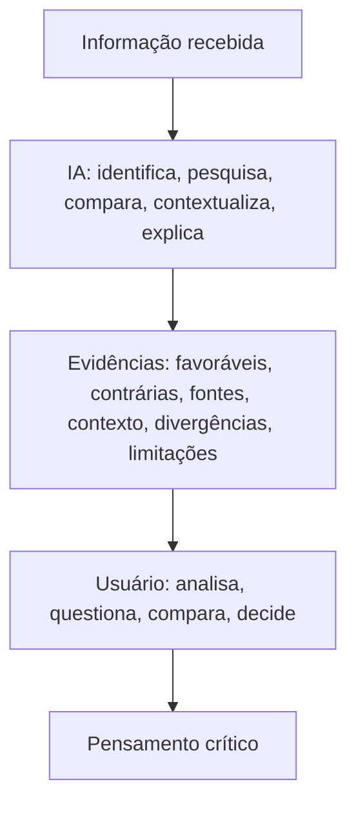

# Visão geral

## Contexto

Este projeto propõe o desenvolvimento de um sistema conversacional integrado ao Telegram capaz de auxiliar usuários na avaliação da confiabilidade de informações recebidas por meio de mensagens, links e outros conteúdos digitais.

O sistema utiliza técnicas de inteligência artificial, processamento de linguagem natural, recuperação de informações e análise de fontes para investigar afirmações presentes nas mensagens enviadas pelos usuários.

O objetivo principal **não** é desenvolver um mecanismo que classifique informações simplesmente como "verdadeiras" ou "falsas". A proposta é usar a IA como ferramenta de apoio ao processo de investigação, apresentando ao usuário evidências favoráveis e contrárias, fontes relevantes, contexto, divergências entre fontes e limitações da análise. O usuário permanece responsável pela avaliação final da informação.

!!! quote "Questão norteadora"
    Como um sistema de IA pode ajudar as pessoas a avaliar a confiabilidade de informações sem substituir seu pensamento crítico?

A partir dessa questão, o sistema é projetado para não funcionar como uma autoridade que determina aquilo em que o usuário deve acreditar, mas como um assistente que torna o processo de investigação mais acessível.

## O problema

A circulação de informações em plataformas digitais permite que conteúdos sejam produzidos e compartilhados em grande velocidade. Mensagens podem ser encaminhadas para dezenas ou centenas de pessoas em poucos minutos, muitas vezes sem que o conteúdo original seja consultado ou verificado.

O problema não se limita à existência de informações falsas. Uma informação pode ser:

- completamente falsa;
- verdadeira, mas apresentada fora de contexto;
- baseada em um fato real, mas exagerada;
- desatualizada;
- uma interpretação apresentada como fato;
- uma opinião apresentada como informação objetiva;
- uma sátira interpretada literalmente;
- baseada em uma fonte real que não sustenta a conclusão apresentada;
- baseada em múltiplas páginas que apenas reproduzem uma mesma fonte original.

Além disso, a quantidade de informações disponíveis torna a verificação manual difícil para usuários comuns. Mesmo quando uma pessoa decide investigar uma mensagem, pode encontrar diversas páginas com informações conflitantes, fontes pouco confiáveis ou conteúdos que repetem a mesma afirmação sem apresentar evidências independentes.

Por isso, o problema investigado pelo projeto não é simplesmente "como detectar fake news?", e sim:

!!! quote ""
    Como auxiliar uma pessoa a avaliar criticamente uma informação diante de evidências, fontes e diferentes interpretações?

## Hipóteses do projeto

A hipótese central é que uma ferramenta de IA que apresente evidências, fontes, contexto, divergências e limitações, em vez de fornecer apenas uma classificação de verdadeiro ou falso, pode ajudar o usuário a desenvolver uma avaliação mais crítica da informação.

Uma segunda hipótese é que o benefício da ferramenta pode ser ampliado quando o sistema não apenas fornece informações, mas também faz perguntas e pequenas intervenções que incentivam o usuário a refletir sobre a mensagem.

Assim, o projeto considera que uma boa ferramenta de apoio à verificação deve ter dois objetivos simultâneos:

- auxiliar na análise da informação atual;
- melhorar a capacidade do usuário de analisar informações futuras por conta própria.

## Objetivo geral

Desenvolver e avaliar um sistema conversacional baseado em IA, integrado ao Telegram, capaz de auxiliar usuários na avaliação da confiabilidade de informações por meio da identificação de afirmações, busca e comparação de evidências, apresentação de fontes e explicação das limitações da análise, preservando a autonomia e o pensamento crítico do usuário.

## Objetivos específicos

O sistema deve buscar:

- identificar afirmações verificáveis presentes em mensagens;
- diferenciar afirmações factuais de opiniões, previsões, sátiras e outros tipos de conteúdo;
- buscar fontes relevantes para as afirmações identificadas;
- priorizar fontes primárias e fontes especializadas quando disponíveis;
- identificar evidências favoráveis e contrárias a uma afirmação;
- identificar divergências entre fontes confiáveis;
- identificar possíveis relações de dependência entre diferentes fontes;
- apresentar o contexto necessário para compreender uma informação;
- comunicar incertezas e limitações da análise;
- permitir que o usuário apresente novas fontes;
- permitir que o usuário questione a análise apresentada;
- incentivar o usuário a consultar fontes originais;
- estimular o usuário a realizar sua própria avaliação;
- evitar a apresentação de um veredito absoluto de "verdadeiro" ou "falso";
- avaliar não apenas a precisão técnica do sistema, mas também seu impacto sobre a capacidade de avaliação crítica do usuário.

## Princípio central de produto

Todo o projeto deve retornar à seguinte ideia:

!!! success "Princípio central"
    A ferramenta não existe para dizer ao usuário no que acreditar. Ela existe para tornar o processo de avaliação mais acessível, transparente e educativo.

O resultado ideal **não** é:

> "O bot descobriu que a notícia é falsa."

O resultado ideal **é**:

> "O usuário conseguiu entender quais eram as afirmações, encontrou as fontes, comparou as evidências, percebeu as limitações e tomou uma decisão informada."

## Visão final do produto

A IA está no meio do processo, mas a decisão continua com o usuário.

## Questão central de avaliação

Além de perguntar "a IA consegue identificar informações falsas?", o projeto investiga uma pergunta mais importante:

!!! quote "Diferencial conceitual do projeto"
    Depois de utilizar o sistema, o usuário consegue avaliar melhor uma informação nova sem a ajuda da IA?

O objetivo final não é criar um oráculo de verdade. É criar uma ferramenta que ajude o usuário a investigar melhor, questionar melhor e depender menos da própria ferramenta ao longo do tempo.
